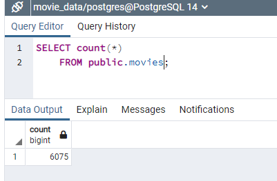
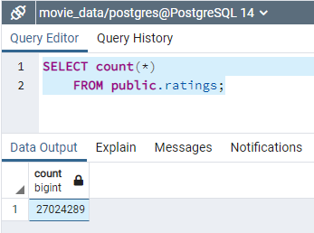

# Movies_ETL
Retrieve data from csv and json files, transform and then load to SQL database.

## Overview of the Challenge
Extract transform and load data

## Results
Data is successfully loaded:

